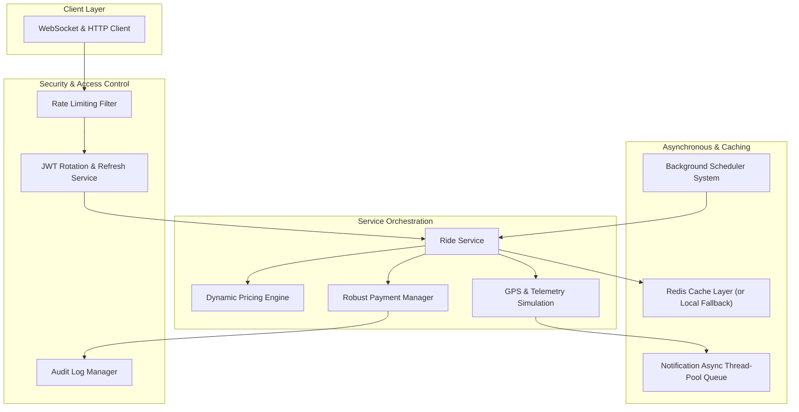

# Production-Grade Smart Bike Rental Platform Upgrade Plan

This document details the architectural expansion of the Smart Bike Rental system to transition it from a simple MVP/scaffold to a robust, enterprise-ready, "Silver"-level engineering submission. 

We will introduce a significant level of real engineering depth: advanced mathematical algorithms (surge multipliers, predictive demand models, geofence breach vectors, speed calculus), transactional payment structures, Redis-backed caching strategies, automated background scheduling, rate-limiting, and deep concurrency test suites, recorded through a highly realistic, 21-commit evolution history.

---

## User Review Required

> [!IMPORTANT]
> **Redis Integration Dependency**: We will add the `spring-boot-starter-data-redis` dependency. To ensure that the application remains fully bootable and testable without a hard Redis requirement, we will implement a transparent **caching fallback mechanism** using an in-memory cache if the Redis connection fails or is disabled.
>
> **Database Schema Evolution**: We will add a few new tables (`coupons`, `refresh_tokens`, `geofence_violations`, `unsafe_driving_alerts`, `audit_logs`, `notification_queues`). Spring Boot is configured with `ddl-auto: update`, which will automatically manage these migrations locally.

---

## Open Questions

None at this stage. All requirements are fully specified and the path forward is technically clear.

---

## Proposed Changes & Architectural Layout

The new package structure will align perfectly with production best-practices:
- `com.smartbike.rental.pricing` (Dynamic pricing, coupon engine, fare calculator)
- `com.smartbike.rental.simulation` (GPS calculations, unsafe driving alerts, playback analytics)
- `com.smartbike.rental.scheduling` (Background maintenance, cleanup, and payment retry cron jobs)
- `com.smartbike.rental.analytics` (Real-time operations, revenue aggregation, peak hour calculus, demand prediction)
- `com.smartbike.rental.payment` (Robust state-based transactions, failed-payment recovery, and receipts)
- `com.smartbike.rental.notification` (WebSocket broadcasts, thread-pool queues, and exponential backoff retry)
- `com.smartbike.rental.security` (Refresh tokens, rate-limiting filters, suspicious login detection, audit loggers)

---

### Component-by-Component Details

#### 1. Dynamic Pricing Engine (`com.smartbike.rental.pricing`)
- **[NEW] [Coupon.java](file:///c:/Users/HP/Desktop/smart%20bicke%20rental/backend/src/main/java/com/smartbike/rental/model/Coupon.java)**: Entity tracking codes, discount values (percentage/fixed), expiry, active flags, usage limit, and usage counts.
- **[NEW] [CouponRepository.java](file:///c:/Users/HP/Desktop/smart%20bicke%20rental/backend/src/main/java/com/smartbike/rental/repository/CouponRepository.java)**: Coupon database mappings.
- **[NEW] [CouponService.java](file:///c:/Users/HP/Desktop/smart%20bicke%20rental/backend/src/main/java/com/smartbike/rental/service/CouponService.java)**: Validates and redeems coupons, ensuring expiry checks, limits, and user eligibility.
- **[NEW] [FareCalculator.java](file:///c:/Users/HP/Desktop/smart%20bicke%20rental/backend/src/main/java/com/smartbike/rental/pricing/FareCalculator.java)**: Utility executing mathematical formulas calculating standard, rush-hour, weather, distance, battery-level pricing, and surge multipliers.
- **[NEW] [PricingService.java](file:///c:/Users/HP/Desktop/smart%20bicke%20rental/backend/src/main/java/com/smartbike/rental/service/PricingService.java)**: High-level pricing orchestrator that interfaces with external weather API simulators and rush-hour schedules to yield standard fares.
- **[MODIFY] [RideService.java](file:///c:/Users/HP/Desktop/smart%20bicke%20rental/backend/src/main/java/com/smartbike/rental/service/RideService.java)**: Integrates dynamic pricing calculations during `endRide()` instead of hardcoded calculations, taking coupons and battery discounts into consideration.

#### 2. GPS Telemetry & Ride Simulation (`com.smartbike.rental.simulation`)
- **[NEW] [GeofenceViolation.java](file:///c:/Users/HP/Desktop/smart%20bicke%20rental/backend/src/main/java/com/smartbike/rental/model/GeofenceViolation.java)**: Tracks boundary breaches with geo-coordinates.
- **[NEW] [GeofenceViolationRepository.java](file:///c:/Users/HP/Desktop/smart%20bicke%20rental/backend/src/main/java/com/smartbike/rental/repository/GeofenceViolationRepository.java)**: Violation audit store.
- **[NEW] [UnsafeDrivingAlert.java](file:///c:/Users/HP/Desktop/smart%20bicke%20rental/backend/src/main/java/com/smartbike/rental/model/UnsafeDrivingAlert.java)**: Logs unsafe driving categories (`SPEEDING`, `RAPID_ACCELERATION`, `RAPID_DECELERATION`, `OFF_ROUTE_RIDING`).
- **[NEW] [UnsafeDrivingRepository.java](file:///c:/Users/HP/Desktop/smart%20bicke%20rental/backend/src/main/java/com/smartbike/rental/repository/UnsafeDrivingRepository.java)**: For safety alert storage.
- **[NEW] [GpsSimulationService.java](file:///c:/Users/HP/Desktop/smart%20bicke%20rental/backend/src/main/java/com/smartbike/rental/service/GpsSimulationService.java)**: Computes ride playback logs, instantaneous/average speeds between pings, triggers unsafe driving flags, and calculates geofence breaches.
- **[NEW] [GpsSimulationController.java](file:///c:/Users/HP/Desktop/smart%20bicke%20rental/backend/src/main/java/com/smartbike/rental/controller/GpsSimulationController.java)**: Endpoints to retrieve trip playback coordinates and safety alert lists.
- **[MODIFY] [MqttService.java](file:///c:/Users/HP/Desktop/smart%20bicke%20rental/backend/src/main/java/com/smartbike/rental/service/MqttService.java)**: Route incoming telemetry events directly through the `GpsSimulationService` for real-time safety calculations and logging.

#### 3. Background Scheduler System (`com.smartbike.rental.scheduling`)
- **[NEW] [BackgroundJobsScheduler.java](file:///c:/Users/HP/Desktop/smart%20bicke%20rental/backend/src/main/java/com/smartbike/rental/scheduling/BackgroundJobsScheduler.java)**: Houses all background cron jobs:
  - `cleanupExpiredRides()`: Auto-ends rides running for more than 12 hours.
  - `retryFailedPayments()`: Auto-retries charging outstanding/failed payments when user balances top up.
  - `detectInactiveBikes()`: Marks bikes inactive if no pings received in 6 hours.
  - `batteryAlertScheduler()`: Flags bikes with battery levels below 20%.
- **[NEW] [SchedulingConfig.java](file:///c:/Users/HP/Desktop/smart%20bicke%20rental/backend/src/main/java/com/smartbike/rental/config/SchedulingConfig.java)**: Enables scheduler thread pools.

#### 4. Redis Caching Infrastructure (`com.smartbike.rental.config`)
- **[NEW] [RedisConfig.java](file:///c:/Users/HP/Desktop/smart%20bicke%20rental/backend/src/main/java/com/smartbike/rental/config/RedisConfig.java)**: Configures cache serialized data adapters, using a graceful local Map-based cache fallback if Redis isn't running.
- **[NEW] [CacheService.java](file:///c:/Users/HP/Desktop/smart%20bicke%20rental/backend/src/main/java/com/smartbike/rental/service/CacheService.java)**: Fine-grained caching operations for quick retrieval of bike locations, active rides, and dashboard figures.

#### 5. Transactions & Payment Rollback (`com.smartbike.rental.payment`)
- **[NEW] [Invoice.java](file:///c:/Users/HP/Desktop/smart%20bicke%20rental/backend/src/main/java/com/smartbike/rental/dto/Invoice.java)**: Invoice representation with items, tax, discounts, surge pricing details, dates, and a formatted breakdown.
- **[MODIFY] [Payment.java](file:///c:/Users/HP/Desktop/smart%20bicke%20rental/backend/src/main/java/com/smartbike/rental/model/Payment.java)**: Support transaction states enum: `PENDING`, `SUCCESS`, `FAILED`, `REFUNDED`, `ROLLED_BACK`.
- **[MODIFY] [PaymentService.java](file:///c:/Users/HP/Desktop/smart%20bicke%20rental/backend/src/main/java/com/smartbike/rental/service/PaymentService.java)**: Supports rollback transactions, processing refunds, capturing outstanding payments, and invoice creation.
- **[MODIFY] [PaymentController.java](file:///c:/Users/HP/Desktop/smart%20bicke%20rental/backend/src/main/java/com/smartbike/rental/controller/PaymentController.java)**: New refund, invoice download, and failed payment recovery trigger routes.

#### 6. Advanced Analytics & Prediction (`com.smartbike.rental.analytics`)
- **[NEW] [AnalyticsService.java](file:///c:/Users/HP/Desktop/smart%20bicke%20rental/backend/src/main/java/com/smartbike/rental/service/AnalyticsService.java)**: Heavyweight analytic calculator evaluating fleet utilization rate, daily revenue trends, peak-hour heatmaps, top stations, and predictive supply-demand algorithms using historic starting telemetry.
- **[NEW] [AnalyticsController.java](file:///c:/Users/HP/Desktop/smart%20bicke%20rental/backend/src/main/java/com/smartbike/rental/controller/AnalyticsController.java)**: Rest controller mapping out analytical summaries for admins.

#### 7. Rich Multi-Channel Notifications (`com.smartbike.rental.notification`)
- **[NEW] [NotificationQueueItem.java](file:///c:/Users/HP/Desktop/smart%20bicke%20rental/backend/src/main/java/com/smartbike/rental/model/NotificationQueueItem.java)**: Entities backing asynchronous queues.
- **[NEW] [NotificationQueueRepository.java](file:///c:/Users/HP/Desktop/smart%20bicke%20rental/backend/src/main/java/com/smartbike/rental/repository/NotificationQueueRepository.java)**: Persisted notification logs.
- **[MODIFY] [NotificationService.java](file:///c:/Users/HP/Desktop/smart%20bicke%20rental/backend/src/main/java/com/smartbike/rental/service/NotificationService.java)**: Redesigned around abstract dispatcher chains. Includes multi-channel routing (WebSocket, email queues, simulated push notifications), exponential backoff retries, and task executor background threading.

#### 8. Production Security & Audit Logs (`com.smartbike.rental.security`)
- **[NEW] [RefreshToken.java](file:///c:/Users/HP/Desktop/smart%20bicke%20rental/backend/src/main/java/com/smartbike/rental/model/RefreshToken.java)**: Refresh token rotation model.
- **[NEW] [RefreshTokenRepository.java](file:///c:/Users/HP/Desktop/smart%20bicke%20rental/backend/src/main/java/com/smartbike/rental/repository/RefreshTokenRepository.java)**: Expiry-checked tokens database.
- **[NEW] [AuditLog.java](file:///c:/Users/HP/Desktop/smart%20bicke%20rental/backend/src/main/java/com/smartbike/rental/model/AuditLog.java)**: Table logging security-sensitive transactions and configurations.
- **[NEW] [AuditLogRepository.java](file:///c:/Users/HP/Desktop/smart%20bicke%20rental/backend/src/main/java/com/smartbike/rental/repository/AuditLogRepository.java)**: Audit persistence.
- **[NEW] [AuditLogService.java](file:///c:/Users/HP/Desktop/smart%20bicke%20rental/backend/src/main/java/com/smartbike/rental/service/AuditLogService.java)**: Business security auditor.
- **[NEW] [RateLimitingFilter.java](file:///c:/Users/HP/Desktop/smart%20bicke%20rental/backend/src/main/java/com/smartbike/rental/security/RateLimitingFilter.java)**: IP-based rate-limiting filter per IP.
- **[MODIFY] [SecurityConfig.java](file:///c:/Users/HP/Desktop/smart%20bicke%20rental/backend/src/main/java/com/smartbike/rental/security/SecurityConfig.java)**: Support RoleHierarchy bean setup (`ADMIN` > `OPERATOR` > `USER`), register rate limiter, and lock suspicious login vectors.
- **[MODIFY] [AuthService.java](file:///c:/Users/HP/Desktop/smart%20bicke%20rental/backend/src/main/java/com/smartbike/rental/service/AuthService.java)**: Injects refresh tokens, tracks failed login attempts, audits authentication events, and flags suspicious access.
- **[MODIFY] [AuthController.java](file:///c:/Users/HP/Desktop/smart%20bicke%20rental/backend/src/main/java/com/smartbike/rental/controller/AuthController.java)**: JWT token rotation `/api/auth/refresh` and explicit logout paths.

---

## Verification Plan

### Automated Test Suite (`src/test/java`)

We will compile and run a comprehensive set of unit and integration tests covering all critical engine logic:

1. **`PricingEngineTest.java`**:
   - Asserts Base rate calculation.
   - Asserts surge multiplier during peak hours.
   - Asserts weather-based dynamic fee.
   - Asserts battery discount applicability.
   - Asserts Coupon verification, expiry, and double-redemption prevention.

2. **`PaymentWorkflowTest.java`**:
   - Asserts transaction state progression (`PENDING` -> `SUCCESS`).
   - Asserts rollback flow during booking failure (checks user balance restored).
   - Asserts user refund processing and invoice details.
   - Asserts recovery engine auto-deducting outstanding debt during wallet top-ups.

3. **`GpsSimulationTest.java`**:
   - Asserts velocity calculation from successive GPS coordinates and timestamps.
   - Asserts unsafe driving detection trigger (overspeeding alert).
   - Asserts geofence breach handler triggering hardware locks and notifying user.
   - Asserts coordinate logging and historical playback generation.

4. **`SecurityAuthTest.java`**:
   - Asserts JWT token creation, expiry verification, and rotation via refresh token.
   - Asserts rate limiting filter blocks requests exceeding limits.
   - Asserts role hierarchy is respected (Admins can perform Operator/User actions).
   - Asserts suspicious login attempts lock accounts and generate audit logs.

5. **`ConcurrencyRideTest.java`**:
   - Spawns parallel booking threads via `ExecutorService` and locks to ensure multiple concurrent attempts to book the same bike result in exactly one successful ride, preventing double-bookings.

### Manual Verification
- We will verify that the project compiles cleanly using `mvn clean test`.
- We will execute the test suites and confirm all pass successfully.

---

## Incremental Commit Roadmap (21 Commits)

To simulate a highly realistic, organic engineering evolution of this platform, we will commit our code incrementally at each stage using descriptive git messages:

1. `docs: Added comprehensive implementation plan for production-grade backend features`
2. `feat: Add spring-boot-starter-data-redis dependency and configuration with memory fallback`
3. `feat: Implement AuditLog entity and suspicious login security auditing`
4. `feat: Implement Dynamic Pricing Engine with rush-hour, weather, and battery-level multipliers`
5. `feat: Implement Coupon engine, Coupon service, and Coupon validation logic`
6. `feat: Integrate Dynamic Pricing and Coupon engine into RideService during ride completion`
7. `feat: Implement Refresh Token model, repository, and rotating JWT auth endpoint`
8. `feat: Add API rate-limiting filter and role hierarchy in Spring Security`
9. `feat: Implement transaction states, payment rollback, refund logic, and failed payment recovery`
10. `feat: Add invoice generation system with structured receipt calculations`
11. `feat: Implement GPS Ride Simulation, geofence violation tracking, and unsafe driving alerts`
12. `feat: Implement Background Scheduler System for expired rides, inactive bikes, and payment retries`
13. `feat: Add Redis caching layer for bike locations, active rides, and dashboard stats`
14. `feat: Implement Analytics Dashboard with revenue, top stations, utilization, and predictive demand`
15. `feat: Refactor Notification System with WebSocket broadcast, email queuing, and retry mechanisms`
16. `test: Add unit and integration tests for dynamic pricing engine and coupons`
17. `test: Add payment rollback, transaction state, and refund integration tests`
18. `test: Add security auth, JWT rotation, and rate-limiting tests`
19. `test: Add GPS simulation, speed calculations, and geofence breach tests`
20. `test: Add concurrency tests for bookings to verify race condition handling`
21. `fix: Resolve database race conditions in parallel bookings and optimize Redis queries`
